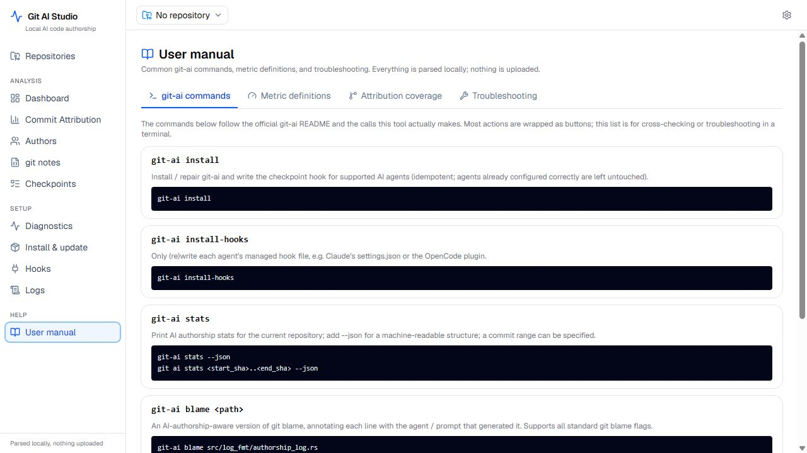

<div align="center">

# git-ai-studio

**See exactly which lines your AI wrote.**

A free desktop dashboard for AI code authorship — for macOS, Linux, and Windows.

[](LICENSE)


[简体中文](README.zh-CN.md)

</div>

---



## What it is

git-ai-studio turns your local git history into a live picture of human-versus-AI authorship. It reads the `refs/notes/ai` written by the [`git-ai`](https://github.com/git-ai-project/git-ai) CLI — every Claude Code, Cursor, Codex, or OpenCode edit is already on disk, line for line — and renders it as a dashboard you can open when you want to know: today's AI share, which files an agent touched last night, and a `git blame` where each row is tinted by the model that wrote it.

Until now you either trusted vendor dashboards that count keystrokes inside their own IDE, or you wrote spreadsheets from `git log`. **git-ai-studio shows you what actually landed in `main`, parsed entirely on your machine — the only thing it sends is a single version check to GitHub at launch (no telemetry, no account, no crash reporter).**

See [`docs/product/PR-FAQ.md`](docs/product/PR-FAQ.md) for the full positioning and FAQ.

## Why now

- [Stack Overflow 2025](https://survey.stackoverflow.co/2025/ai/) (n=49k): **51% of professional developers use AI coding tools daily**
- [Sonar State of Code 2026](https://www.sonarsource.com/state-of-code-developer-survey-report.pdf): **26.9% of production code is AI-authored**, up from 22% the prior quarter
- Most teams now run *more than one* agent (Claude Code + Cursor + Codex is a common stack) — vendor-specific dashboards see only their own keystrokes
- `git-ai` shipped a stable v3 spec for `refs/notes/ai`, giving a vendor-neutral substrate to read from

## Features

- **Dashboard** — repository-level AI share, hook coverage, recent commits at a glance
- **Stats** — per-commit detail with tool/model breakdown (Claude Sonnet vs Cursor vs Codex …)
- **People** — per-author AI contribution over a rolling window
- **Blame** — file-level, line-by-line: who wrote it, which model, via which prompt
- **Checkpoints / Notes** — inspect raw `refs/notes/ai` payloads from the AI agents
- **Hooks / Diagnostic** — install official `git-ai` hooks for your agent in one click; diagnose env in one screen
- **Desktop pet** (opt-in, off by default) — an ink-drop companion in a screen corner whose two-tone blend mirrors your live AI share, and that shifts shape when the hook is missing, a commit fails to tag, or the daemon gets stuck. _Known limits:_ the transparent overlay needs a compositor on Linux and may fall back to opaque on older Windows WebView2 builds; selective click-through is deferred to a later release. See [ADR-011](docs/adr/0011-desktop-companion-ink-pet.md).

All parsing happens locally. No account, no telemetry, no crash reporter — just a single version-number check to GitHub at launch (turn it off with `plugins.updater.active=false`).

## Quick start

> Early access. Download the latest installer from [GitHub Releases](https://github.com/bujueyunjian/git-ai-studio/releases/latest).

- **macOS**: download the `.dmg` and drag the app to Applications
- **Linux**: download the `.AppImage` or `.deb` package for your architecture
- **Windows**: download the `.msi`; Windows may show a first-run security warning while code signing is not available

Then point the app at any git repository with `refs/notes/ai`. If the repo has no notes yet, follow the in-app Hooks guide to install official `git-ai` hooks for your agent (Claude Code / Cursor / Codex / OpenCode); your next AI-assisted commit appears live.

To build from source:

```bash
# Requirements: Node 20+, pnpm 9+, Rust 1.80+, git-ai CLI installed
pnpm install
pnpm tauri:dev
```

## Status

**Early access. Current version: [v0.4.0](https://github.com/bujueyunjian/git-ai-studio/releases/tag/v0.4.0).** The project has shipped 10 public releases for macOS, Linux, and Windows since May 2026. Development, release history, and issue tracking are public; v1.0 remains the milestone for broader user validation.

Before v1.0, the project aims to complete:

1. 3 real user interviews validating the daily-glance assumption (see [PR-FAQ](docs/product/PR-FAQ.md))
2. 4-week local opt-in usage-counter readout from 5 friends
3. Architecture decisions in [`docs/adr/`](docs/adr/) accepted by maintainers

## Relationship to `usegitai.com`

git-ai-studio is an **independent open-source project, not affiliated with the Git AI commercial team**. We consume only the open-source `git-ai` CLI and the public `refs/notes/ai` standard. [Git AI Teams / Cloud](https://usegitai.com) is an org-level SaaS dashboard sold to VPs of Engineering; this is a single-developer local desktop client — different surface, different buyer. If upstream releases an official desktop GUI, we will reassess scope. See [FAQ #6](docs/product/PR-FAQ.md) for the full statement.

## Privacy

100% local. No account creation, no telemetry, no crash reporter. The one automatic network call is a single version-number check to GitHub about a second after launch — it sends no code, no repository data, no personal data, only a version number, so you don't silently miss security fixes; if a newer version exists you can install it in one click (minisign-verified). You can turn this check off entirely by building with `plugins.updater.active=false`. Every other outbound call is one you explicitly trigger: `git-ai` install/upgrade from GitHub Releases, and optional `git push refs/notes/ai` to your own remote. See [ADR-010](docs/adr/0010-in-app-auto-update.md) for the rationale.

## Documentation

- [`docs/product/PR-FAQ.md`](docs/product/PR-FAQ.md) — positioning and FAQ
- [`docs/adr/`](docs/adr/) — architecture decision records
- [`CLAUDE.md`](CLAUDE.md) — codebase conventions (for AI coding assistants and human contributors)

## Contributing

PRs welcome — see [`CONTRIBUTING.md`](CONTRIBUTING.md). Please open an issue first for non-trivial changes so we can align on scope.

## License

[MIT](LICENSE). © 2026 git-ai-studio contributors.

## Acknowledgements

- [`git-ai`](https://github.com/git-ai-project/git-ai) — the CLI that does the real work; this app is its visualization layer
- [Tauri](https://tauri.app/) — Rust + webview shell that makes a tiny privacy-friendly desktop binary practical
- The teams behind Radix UI, Tailwind CSS, TanStack Query, CodeMirror, recharts, sonner — every dependency of this project is itself an open-source gift
